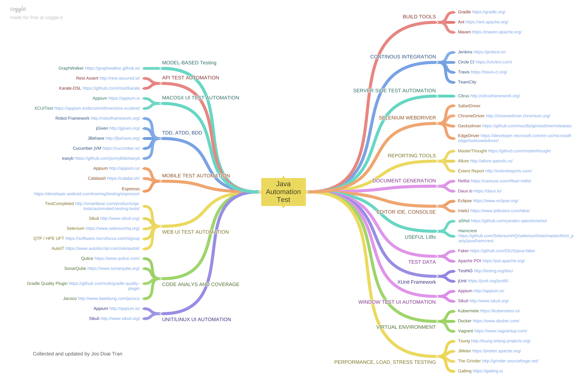

# Software Testing Everything
To collect everything about software testing.

1. 7 principles of software testing:
[ISTQB](https://astqb.org/istqb-foundation-level-seven-testing-principles/)
2. Test design techniques:
[Link](https://testsigma.com/blog/test-case-design-techniques/)

# All notes for the ISTQB Examination
## Foundation Level:
All here: https://doaitran.notion.site/Question-Collection-Foundation-Level-Exam-ed961ebad8df495a824103f28f3ebd64

- FlashCard - 1: https://quizlet.com/vn/738443631/de-12-flash-cards/?funnelUUID=789b4187-29c2-40b4-a358-a399ac806806
- FlashCard - 2: https://quizlet.com/549175619/flashcards?funnelUUID=89dbd882-e1c5-4662-924f-186059b286f7
- FlashCard - 3: https://quizlet.com/453686261/istqb-foundation-level-flash-cards/
- Statement Coverage: https://www.istqb.guru/how-to-calculate-statement-branchdecision-and-path-coverage-for-istqb-exam-purpose/

# Books for Software Testing

1. Foundation Of Software Testing: ISTQB Certification [Link](https://www.istqb.org/certifications/certified-tester-foundation-level)
2. Agile Testing [Link](https://www.amazon.com/Agile-Testing-Practical-Guide-Testers/dp/0321534468)
3. Modern Agile Testing [Link](https://www.oreilly.com/library/view/more-agile-testing/9780133749571/)

# Test Estimation
In [ISTQB glossary](https://istqb-glossary.page/test-estimation/)

# Test Management tools
There are many options for us to choose Test management tools: To manage test cases, Manage and report testing results, ...
- TestLink [Link](https://testlink.org/)
Tags: #free, #open-source
- Testrails: [Link](https://www.testrail.com/)
- Xray: [Link](https://www.getxray.app/test-management)
- Using Jira Custom Project to manage test cases and test reports for a projects
- ...

# UI/UX Testing Note
All notes about UI/UX and visual testing: [Here](https://github.com/josdoaitran/software-testing-everything/blob/master/ux-ui-visual-testing.md)

# Test Impact Analysis:
Test Impact Analysis (TIA) is a modern way of speeding up the test automation phase of a build. It works by analyzing the call-graph of the source code to work out which tests should be run after a change to the production code. Microsoft has done some extensive work on this approach, but it's also possible for development teams to implement something useful quite cheaply.
References:
- https://martinfowler.com/articles/rise-test-impact-analysis.html
- https://continuoustesting.dev/2017/02/07/model-based-testing-and-test-impact-analysis/

# Microservice Testing
All notes about Microservice testing: https://github.com/josdoaitran/microservices-everything

# Serverless - Framework
- All notes about Serverless testing here: https://github.com/josdoaitran/microservices-everything/blob/main/serverless-testing.md

- Serverless Github: https://github.com/serverless/serverless

# Micro-Frontend Testing
All notes about Micro-Frontend testing: https://github.com/josdoaitran/microservices-everything/blob/main/testing-for-microfrontend-modular-architecture.md

# Automation Testing
- Java Stack Automation test collection 

- Note tools for automation test: https://github.com/josdoaitran/software-testing-everything/blob/master/automation_testing/Readme.md

# AI with Testing
In this note, we focus on: 
- Apply AI to cover Visual Testing.

## Visual AI Testing Tools:
These tools AI Testing tools:
- Applitools: https://applitools.com/
- Percy.io: https://percy.io/pricing
- Percy Broswerstack: https://www.browserstack.com/percy?utm_source=google&utm_medium=cpc&utm_platform=paidads&utm_content=668810924522&utm_campaign=Search-Brand-APAC-Product&utm_campaigncode=Percy+1028581&utm_term=e+percy%20browserstack&gad_source=1&gclid=CjwKCAiAvoqsBhB9EiwA9XTWGYHvz98pbWLq3yA93LVqhPN9X08ZjvL1n_7AHCZAzzZpBF_bPi7bIxoCPxYQAvD_BwE

# Testing Mnemonics
https://www.testmakker.dk/2019/03/30/testing-mnemonics/

# Session Base Testing, Exploratory Testing
https://testsigma.com/blog/session-based-testing/
https://www.infoq.com/articles/session-based-test-management/

# Agile Testing Quadrant

Reference more: https://developsense.com/resource/RSTAgileTesting.pdf

# References:
- Software Testing Heuristics Mind: https://www.ministryoftesting.com/search?q=software+testing+heuristics+mind+the+gap
- Session Base Testing: https://testsigma.com/blog/session-based-testing/
- References about all automation test framework: https://github.com/atinfo/awesome-test-automation/tree/master
- ROI: https://www.browserstack.com/guide/calculate-test-automation-roi
