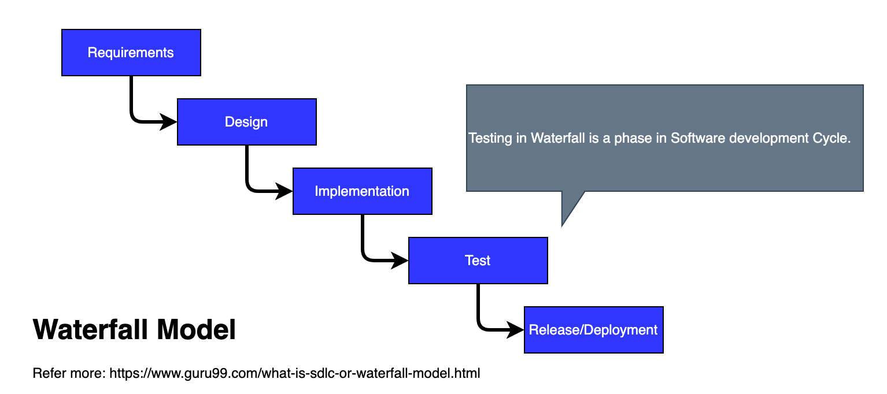
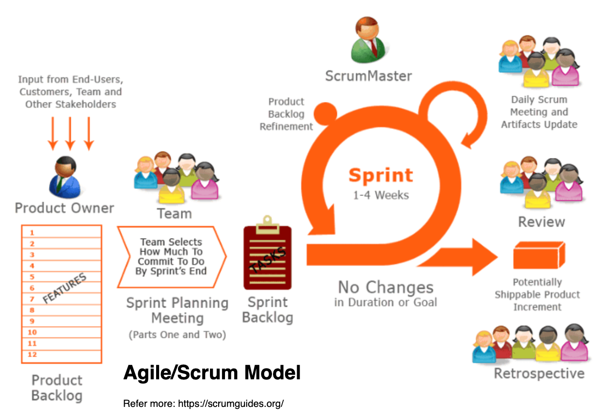

# What is continous testing ?

In this document, I would like to summarize the most important things about *Continous testing*, the detailed information about Why our trending is continous testing, even how we can apply some best-practice to your projects / products.

With the rising of Agile/ Scrum methodologies and Continous Delivery, the demands of ealier testing, receiving the testing result sooner are increasing highly, and our test trending is Continous testing, that helps our Developement team accelerate and priorotize testing to meet the expectation of faster development's speed, fast-paced in Agile/Scrum, Devops, ...

+ Agile: https://agilemanifesto.org/
+ Devops: https://aws.amazon.com/devops/what-is-devops/

In the traditional testing approach, the speed of software delivery and ealier testing are limited.  Continuous testing and Agile testing will help us overcome the legacy problem on the old testing approaches.

+ Accelerate delivery with high confidence (Software).
+ Low business risk. (Feedback sooner, Business outcome is soon)
+ More realistic test, especially single application is built in microservice model (serveral services), isolated testing, more testing levels to cover more.
+ Continuous Integration - Continous delivery.

# Tranditional testing with several blockers:

Testing is a important in development and delivery of a software. The testing approach can affect not only to the way of assuring the quality of a Software Product, but also to the speed of delivery of our software.
In Software release's demands, we always hope to receive the feedback soon, reducing unacceptance risks, ... and specially to detect the risks, failures of 

In Tranditional testing approach, The tester or QA/QC will involve at the end of each release. Testing in Tranditional approach is a phase of a release. The most important thing in software testing, we can't do everything, all cases to assure our software has no error - "testing everything" approach. If we define and execute testing at the end of release. Your testing efforts will become the huge blockers, huge factors to your success's products.

In this image, we can see the more information about Tranditional testing and the issue that we can usually face in Tranditional Testing:

## Tranditional testing in Waterfall Software Development Life Cycle.

If your business is applying the Software Development Life Cycle - Waterfall model, absolutely you will be in Traditional Testing.

+ We usually focus on Testing only once your QAs/QCs have the build.

+ Your teams's structure is built in Component model.
Your QA/QC members work together in QA team. After they receive the build, they will base on the requirements / their test cases to execute testing to evaluate the quality of build.

+ If any changes or modifications of requirement, we have to wait to next release. Late feedback and not flexible.

+ Less feedback and testing efforts were involve at ealier phases (Reqirements analysis, Design, Implimentation phase) of each release.

## Trandional testing in some anti-parttern of Agile/Scrum.

Based on my experiences. Traditional testing appears not only on the project with Waterfall model but also on the project with Agile/ Scrum model.

In trending, we always built our development team methodology in Agile/ Scrum model. However, it is not sure that we'll overcome the Traditional Testing mindset completely.

In Scrum model, our team will focus testing efforts in Sprint by Sprint. Trandittional testing mindset is still in our team ways of working, if:
- Our team keep testing as a phase in a Sprint. 
- Our team members still keep the tranditional WOW (Ways of working), they focus on their technical perspective to complete their tasks in each Sprint. DEV members focus on their view to implement their coding tasks, deploy and provide new build to QA. Testing efforts will be considered when QA received the build from DEV.

The values of the modern Agile testing are:
+ Earlier testing.
+ Sooner feedback.
+ Cross-functional team will take responsibilities for Quality of Product.
+ Testing more and testing is not a phase.

With the emergence of DevOps and developments of technical solutions for Continous Integration/Continous Delivery (CI/CD), the demands for testing in Agile testing increased rapidly.

# Continous testing:
In Agile/Scrum Models, we face with demands:

- Continuous integration: is a software development practice where members of a team use a version control system and frequently integrate their work to the same location, such as a main branch. Each change is built and verified to detect integration errors as quickly as possible. Continuous integration is focused on automatically building and testing code, as compared to continuous delivery, which automates the entire software release process up to production.
- Continuous Delivery: is a software development methodology where the release process is automated. Every software change is automatically built, tested, and deployed to production. Before the final push to production, a person, an automated test, or a business rule decides when the final push should occur. Although every successful software change can be immediately released to production with continuous delivery, not all changes need to be released right away.

- Then, Continuous Testing can be considered as the biggest challenges for us. We always expect that Testing is not a blocker to prevent us eccelerate our Software Delivery Speed.
With Continuous integration and Continuous delivery, Testing also is expected to be continuous and less manual testing efforts.

# How we run Continous testing effectively ?

One of the most important factors of software testing is testing levels in each testing environments to make sure the realistic of test coverages in our test approaches.
In coutinous testing, we are apply several testing levels with our automation testing solutions to help us eccelerate 

## References:
- Enteprise Continuous testing - Transforming Testing for Agile and Devops - By Wolfgang Platz With Cynthia Dunlop
- https://www.tricentis.com/learn/what-is-continuous-testing
- https://katalon.com/resources-center/blog/continuous-testing-introduction
- https://www.onpathtesting.com/blog/end-to-end-vs-integration-testing
- https://www.researchgate.net/figure/The-Scrum-methodology-Source-15_fig2_333784632
- https://docs.aws.amazon.com/codepipeline/latest/userguide/concepts-continuous-delivery-integration.html
